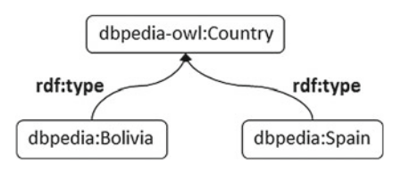
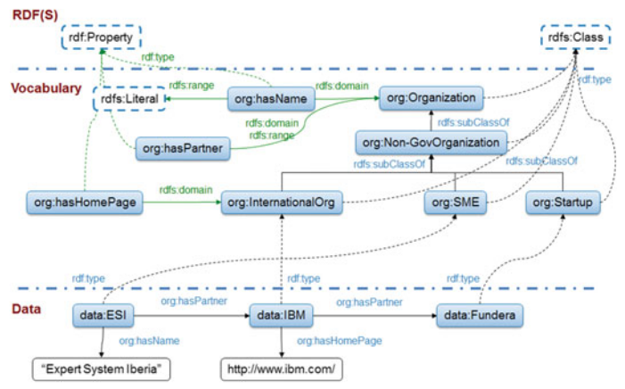

# 2.1 知识表示和查询语言

知识表示和推理（Knowledge Representation and Reasoning, KR）是人工智能（Artificial intelligence, AI）的一个领域，致力于以表单形式表示信息，以便计算机进行相关信息的自动推理，从而解决诸如决策支持之类的复杂任务。如第一章所述，知识图谱可以看作是KR的一些现代变体，称为语义网络。

知识图谱是一组具有类型的实体（具有属性），它们通过关系相互关联。这些实体和关系的类型在称为本体的模式层中定义。这种定义的类型称为术语。在本节中，我们将介绍用于表示知识图谱的标准（RDF）、用于定义本体层的两个标准（RDFS和OWL）以及用于知识图谱查询的标准。请注意，这些标准不会影响人们使用某些自定义序列来构建企业知识图谱。

## 2.1.1 RDF and RDFS

在这一节，我们将介绍RDF（Resource Description Framework）和RDFS（RDF Schema）。正如1.1节所提到的，RDF是语义网络的现代标准。RDFS则是RDF知识图谱的简单模式语言。在2.1.2节，我们将介绍另外一个标准OWL，它为知识图谱提供了更全面的模式语言系列。

### RDF

RDF是W3C（World Wide Web Consortium，W3C）推荐使用的标准，用来描述实体，其中，实体通常被视为W3C中的资源。资源可以是我们可以识别的任何东西，例如人物，主页或“权力的游戏”中的巨龙。在本节中，我们将使用[纽约时报链接数据集](http://datahub.io/dataset/nytimes-linked-open-data)和[DBpedia](http://dbpedia.org/About)中的一些组织示例进行说明。

#### RDF三元组和图

资源在RDF三元组中描述，RDF三元组又称为语句，拥有以下谓词-值对。RDF三元组中的值也可以为资源（图2.1）。
> [subject preicate object .]

RDF图由一组RDF三元组组成，表现为节点定向弧图，其中每个三元组由节点-弧-节点链路标书。在RDF图中有三种节点：国际化资源标识符（Internationalised Resource Identifiers），或IRIs，字面量和空白节点[61]。更准确地说，在一个RDF三元组中，

- 主体可以是IRI或者空节点；
- 谓词应为IRI；
- 客体可以是IRI，字面量或者空节点。

在RDF图中，IRI是一个单独标识资源的字符串[71]。IRIs是统一资源标识符（Uniform Resource Identifiers, URIs）[27]的概括，它允许更广泛的字符。
字面量用于描述诸如字符串，数字和日期之类的值。 RDF图中的字面量由两个或三个元素组成：

- 词汇格式，这是一个Unicode字符串，应该是普通形式C[65]；
- 数据类型IRI，即标识确定词汇格式如何组成字面量的数据类型的IRI；
- 非空语言标记，如果数据类型IRI为http://www.w3.org/1999/02/22-rdf-syntax-ns#langString ，则根据[189]的定义标记为非空语言标记。

空节点既不属于IRI，也不属于字面量，并且可能出现的空节点集是没有规律的。RDF不涉及任何空节点的内部结构。空节点是RDF图中节点的一种，表示未给出IRI或字面量的资源。由空节点表示的资源也称为匿名资源。空节点简单地指示事物的存在，而不使用IRI来标识任何特定事物，具有以下功能：

- 描述多组件结构，如RDF容器;
- 描述具体化，即出处信息;
- 表示复杂属性，而无需明确命名辅助节点，例如：由街道，号码，邮政编码和城市组成的地址;
- 保护内部信息，例如，保护客户的敏感信息免受浏览器的侵害。

图2.2展示了只有一个三元组的RDF图，其中主体为http://dbpedia.org/resource/Bolivia ，谓词为http://dbpedia.org/ontology/longName ，客体为字面量“Plurinational State of Bolivia”。这个三元组表达的意思为，Bolivia的长名为Plurinational State of Bolivia。

IRI通常以被称为命名空间IRI的公共子字符串开头。根据约定，一些命名空间IRI与被称为命名空间前缀的短名称相关联。前缀可以声明如下。

    prefix dbpedia: http://dbpedia.org/resource/
    prefix dbpedia-owl: http://dbpedia.org/ontology/
    prefix xsd: http://www.w3.org/2001/XMLSchema#

图2.3展示了在之前的RDF图（图2.2）中使用已声明的前缀的结果。

此外，我们还可以修改图形并加入字面量的类型，见图2.4。

最后，我们还可以在字面量中包含语言描述，如图2.5所示。

与在1.1中所提到的传统语义网络不同，RDF具有一些语言级预定义属性。这里我们将介绍rdf:type，而另一种类型将在本节后面介绍RDF模式时进行解释。rdf:type属性是用于资源分类的，是语义网络中的is-a关系。图2.6描述了使用rdf:type的一个例子。

#### 序列化RDF

RDF为知识图谱提供了标准的数据模型。目前有几种用于存储和交换RDF的序列化语法，例如Turtle[190]，RDF/XML[3]，RDFa[4]，N-Triples[2]，NQUADS[1]和JSON-LD[220]。

一个Turtle文档允许以紧凑的文本形式序列化RDF。其可以在不属于另一个词法标记的＃之后给出注释，而IRI应该包含在<>中。

    prefix foaf: <http://xmlns.com/foaf/0.1/> #这是朋友的朋友的前缀（foaf）声明。

以下是一些字面量的例子，包括多于一行的长字面量

    "Literal"
    "Literal"@language
    """Long Literal with
    multiple lines"""

这些是数据类型字面量的示例，由“词汇格式”^^数据类型URI组成。

    "10"^^xsd:integer
    "2006-09-04"^^xsd:date

接下来，我们提供三元组和缩写的一些示例。其中三元组以“.”结束，如下所示。

    lab:aleix foaf:knows lab:nuria.
    lab:aleix foaf:knows lab:almu.

我们可以使用“,”来分隔上述例子中具有相同主体和谓词的三元组的不同值，如下所示。

    lab:aleix foaf:knows lab:nuria , lab:almu.

类似的，我们可以使用“;”来分隔具有相同主体的三元组的不同谓词-值对，例如将以下两个三元组

    lab:aleix foaf:nickname "paco".
    lab:aleix foaf:currentProject lab:K-Drive.

转换成：

    lab:aleix foaf:nickname "paco" ; foaf:currentProject lab:K-Drive.

介绍完所有基础知识后，让我们看一下前面提到的一些RDF图。例如，图2.3展示的RDF图可以在Turtle中序列化：

    @prefix dbpedia: <http://dpedia.org/resource/>
    @prefix dbpedia-owl: <http://dbpedia.org/ontology/>

    dbpedia:Bolivia dbpedia-owl:longName "Plurinational State of Bolivia" .
 
而图2.5展示的RDF图则可以在Turtle中序列化为：

    @prefix dbpedia: <http://dpedia.org/resource/>
    @prefix dbpedia-owl: <http://dbpedia.org/ontology/>

    dbpedia:Bolivia dbpedia-owl:longName "Plurinational State of Bolivia"@en .
    dbpedia:Bolivia dbpedia-owl:longName "Plurinational State of Bolivia"@es .

### RDFS

RDFS为RDF提供了一种简单的模式语言，并允许使用预定义的语言级别rdfs:Class或rdfs:Property来声明类或属性。在以下示例中，org:Organization为一个类的声明，而org:hasHomePage为一个属性的声明：

    org:Organization rdf:type rdfs:Class.
    org:Start-up a rdfs:Class. # 我们也可以使用“rdf:type”的缩写“a”来代替“rdf:type”
    org:hasHomePage rdf:type rdfs:Property.

此外，RDFS还可以使用预定义的语言级属性在类和属性之间指定一些依赖关系，例如rdfs:subClassOf，rdfs:subPropertyOf，rdfs:domain，rdfs:range。

- [C1 rdfs:subClassOf C2.]表示C1是C2的一个子类，则所有C1的实例同时也是C2的实例，下述例子表达了org:Start-up是org:Non-GovOrganization的一个子类：

        org:Start-up rdfs:subClassOf org:Organization.

- [P1 rdfs:subPropertyOf P2.]表示P1是P2的一个子属性，则所有P1的实例同时也是P2的实例，下述例子表达了org:hasEnglishHomePage是org:hasHomePage的一个子属性：

        org:hasEnglishHomePage rdfs:subPropertyOf org:hasHomePage.

- [P rdfs:domain C.]表示属性P的定义域是C，则所有拥有属性P的资源都是类C的实例，下述例子表达了所有拥有属性org:hasPersonalHomePage的资源都是org:Organization的一个子类：

        org:hasHomePage rdfs:domain org:Organization.

- [P rdfs:range E.]表示属性P的值域是C，则属性P的值都是E的实例，其中E可以使一个类或者数据类型（例如rdfs:Literal），下述例子表达了org:hasHomePage的值域是rdfs:Literal：

        org:hasHomePage rdfs:range org:Literal.

图2.7中RDF图使用Turtle序列化后，得到：

    @prefix org: <http://www.w3.org/ns/org#>
    @prefix rdf: <http://www.w3.org/1999/02/22-rdf-syntax-ns#>
    @prefix rdfs: <http://www.w3.org/2000/01/ref-schema#>
    @prefix data: <http://data.lab.expertsystem.com>

    org:Organization a rdfs:Class.

    org:Non-GovOrganization a rdfs:Class ; rdfs:subClassOf org:Organization.

    org:InternationalOrg a rdfs:Class ; rdfs:subClassof org:Non-GovOrganization.

    org:SME a rdfs:Class ; rdfs:subClassof org:Non-GovOrganization.

    org:Startup a rdfs:Class ; rdfs:subClassof org:Non-GovOrganization.

    org:hasName a rdfs:Property ; rdfs:domain org:Organization ; rdfs:range rdfs:Literal.

    org:hasPartner a rdfs:Property ; rdfs:domain org:Organization ; rdfs:range org:Organization.

    org:hasHomePage a rdfs:Property ; rdfs:domain org:InternationalOrg.

    data:ESI a org:SME ; org:hasPartner data:IBM ; org:hasName "Expert System Iberia".

    data:IBM a org:InternationalOrg ; org:hasPartner data:Fundera ; org:hasHomePage "http://www.ibm.com".

    data:Fundera a org:Startup.

应该注意的是，RDFS作为模式语言,仅提供有限的表达能力。它的局限性如下：

1. 它不支持否定。例如，我们可以用RDF表达data:ESI是org:SME，但不可以表达data:ESI不是一个人。
2. 它不提供构造函数来定义类。例如，我们无法使用RDFS定义什么是org:SME。
3. 尽管它提供了模式级别的对齐（使用rdfs:subClassOf和rdfs:subPropertyOf），但它不支持实例级别的对齐。例如，无法使用其表达data:ESI和db:ESI其实是一样的。

我们将通过使用更全面的模式语言OWL来解决上述限制，这将在下一节中介绍。

## 2.1.2 OWL

不同于作为知识图谱/语义网络的现代标准的RDF，标准本体语言OWL是以一系列称为描述逻辑（Description Logics, DLs）的形式知识表示[16]作为基础的。第一个DL称为KL-One，拥有比语义网络更强大的表达能力，同时保持可判定性。W3C推荐使用OWL的最新版本OWL2[187]作为Web本体的事实标准。OWL本体的推理服务可用于检查知识图谱的逻辑和语义不一致性，同时也支持查询和问答，这部分我们将在本书后面讨论。

从语法上讲，OWL可以被视为RDFS的扩展，具有由OWL模式预定义的[附加词汇表](http://www.w3.org/2002/07/owl)。这种模式词汇​​表为人们构建本体以及注释其数据提供了广泛的强大表达能力，例如合格的基数限制，属性链，自限制，对称，以及反身属性。接下来，我们将展示[Travel本体](http://swatproject.org/travelOntology.asp)中的一些例子，以说明OWL2的表达能力。

    :borders rdf:type owl:ObjectProperty , owl:SymmetricProperty ;
             rdfs:domain :AdministrativeDivision ; 
             rdfs:range :AdministrativeDivision ;
             owl:propertyChainAxiom ( :hasBoundary
                                      :boundaryOf
                                    ).

上述例子说明了：在Travel本体中，在两个AdministrativeDivision实例之间指定了一个名为*boarders*的对象属性。而这个属性有一些无法在RDF（S）中表达的有趣的特征：

1. 这个属性拥有类型owl:SymmetricProperty，这意味着如果实体a的边界为另外一个实体b，则实体b的边界也为实体a。
2. 该属性具有owl：propertyChainAxiom，其中包含另外两个属性hasBoundary和boundaryOf。这意味着，如果a具有边界b，并且b是c的边界，那么a拥有边界c。

以下是描述类的文件中的另外一个片段：

    :SuperContinent rdf:type owl:Class ;
        owl:equivalentClass [rdf:type owl:Class ;
            owl:intersectionOf ( :Island
                [ rdf:type owl:Restriction ;
                  owl:onProperty :hasDirectPart ;
                  owl:onClass :Continent;
                  owl:minQualifiedCardinality "2"^^xsd:nonNegativeInteger
                ]
            )
        ] .

这里定义了*SuperContinent*类，这个类拥有以下有趣的特征：

1. 它由owl：equivalentClass属性定义，这意味着SuperContinent类的任何实例都应满足其等效类属性所包含的描述，并且满足此类描述的任何内容都是SuperContinent的实例。
2. 定义SuperContinent的描述类型为owl：intersectionOf，这意味着这个描述是另外两个描述的结合，如代码所示，其中一个是Island，另一个是owl：Restriction的一个实例。
3. 为owl：Restriction定义了属性hasDirectPart，类Continent及基数≥2。这意味着此限制的实例应该与至少两个不同的Continent实例具有hasDirectPart关系。

总的来说，它定义了一个超大陆相当于一个岛屿，该岛屿至少由两片不同的大陆组成，反之亦然。

在上面的示例中，OWL注释提供了可用于发现隐藏信息的语义。例如，根据两个对象之间的hasBoundary关系和boundaryOf关系链，我们可以使用OWL推断出隐藏的边界关系。然而，由于OWL2提供的强大的表达能力，如果不限制OWL2模式词汇的使用，这种推断不一定能在有限的时间内执行完毕。而我们可以使用计算可判定逻辑的相关语法来编写OWL2文件来打破这种限制。

因此，我们引入OWL2 DL语法，其中DL代表描述逻辑。描述逻辑（Description Logic, DL）[16]是一系列使用概念（一元谓词），角色（二元谓词）及其实例来描述话语领域的形式知识表示。DL在不同的领域有不同的表达，在如何构造和使用谓词方面彼此不同。例如，在
