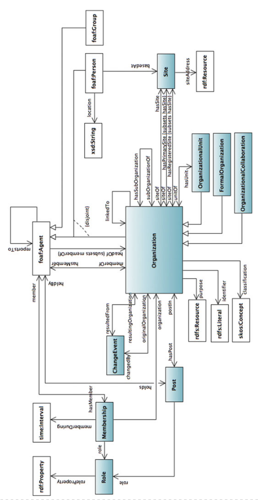
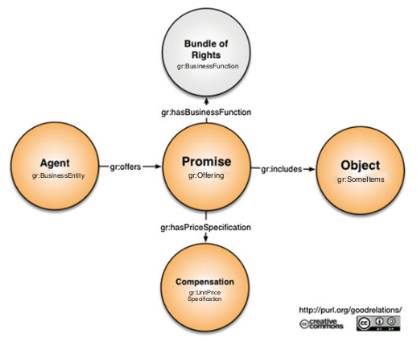
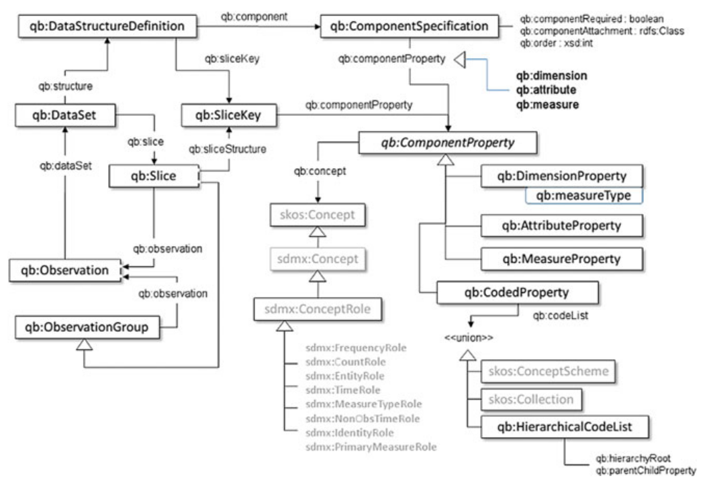

# 2.2 本体和词汇

知识图谱的一个关键要素是充当其模式层的本体。简单的说，本体描述了知识图谱中存在的所有信息。

## 2.2.1 标准词汇表

为了加快知识图谱构建和资源存储的进度，我们需要尽可能的重用现有的词汇表。采用现有词汇表是为了达到对以往工作的最佳重用。从这个意义上说，我们首先需要花时间了解当前可用的资源，因此在本节中，我们将对用于表示知识图谱信息的知名词汇表进行概述。

### 组织本体

组织本体包含了跨多领域的组织信息[201]。该本体中的术语支持以下内容的表达：

- 组织的结构，包括：（1）组织的概念，（2）其子组织和子单位，（3）组织成立的目的和分类
- 人事结构包括：（1）组织内的成员和事务结构，（2）人员和组织之间的角色，职位和关系
- 地点信息，包括站点或建筑物，站点内的位置
- 组织的历史，包括合并历史和更名历史

图2.8展示这个本体的主要组件。

### GoodRelations

GoodRelations是电子商务领域的本体，它定义了描述产品，价格和公司数据的术语[114]，并且用于定义以下数据结构：

- 行业中立性，这意味着它适用于消费电子产品，汽车，门票，房地产，劳务，服务或任何其他类型的商品；
- 在价值链的不同阶段有效，这意味着从原材料到零售到售后服务都有效；
- 语法中立性，这意味着它应该使用RDFa，Turtle，JSON或任何其他流行的语法。

在描述电子商务领域的场景时，这个本体的主要组件有：

- **代理**（agent），可以是个人或者组织。
- **对象**（object），可以是摄像机，房子，汽车等; 或**服务**（service），例如理发。
- **承诺**（promise）或**offer**（要约），转让对象的某些权利或为代理提供的与对象或服务相关的某种补偿服务，
- **location**（地点），承诺或者要约的有效地点。

GoodRelations[114]是一种通用的信息模型，可用于向他人提供任意类型的商品以及指定预期的补偿和条件。图2.9描述了该本体的主要组件。

### Data Cube Vocabulary

Data Cube Vocabulary为线上发布多维数据（如统计数据）提供了可行性。以Data Cube Vocabulary为基础的模型与以统计数据和元数据交换为基础的（Statistical Data and Metadata eXchange，SDMX）[96]的多维数据集模型兼容，其中后者是一种用于在组织之间交换和共享统计数据和元数据的ISO标准。Data Cube Vocabulary依赖于以下RDF词汇表：（1）用于概念方案的SKOS[124]，用于核心统计结构的SCOVO [107]，用于元数据的Dublin Core Terms[158]，用于数据访问的VoiD[7]，用于代理的FOAF[39]和用于组织的ORG[201]。

在Data Cube Vocabulary中，数据集（DataSet）是与定义的结构相对应的统计数据的集合。此数据可以为以下类型之一：

- 观测值，即实际数据，是测量值。在统计表格中，观测值是表格单元格中的值。
- 组织结构，描述观测值中每个维度的值。
- 结构元数据，解释数据集的数据，例如我们需要知道测量单位，或者它是正常值还是一系列断点。这些元数据作为属性方式存在，还可以附加到单个观测值或更高级别。
- 参考元数据，描述整个数据集的数据，例如数据集的分类，发布者等。

此外，一个立方体的主要组件有：

- 维度（dimensions），即观测值的维度，所有维度的值足以识别单个观测值。
- 度量（measure）即观测到的现象。
- 属性（attributes），对观测值进行限定和解释，可指定度量单位，缩放因子和元数据。

图2.10展示了RDF Data Cube Vocabulary的核心组件。

### Friend-of-a-Friend(FOAF)

Friend-of-a-friend（FOAF）本体对描述人群，他们的活动（合作）以及他们与其他人或对象的关系的术语[39]进行了定义。不同应用程序可选择使用FOAF的不同部分。我们可以将FOAF术语分为以下类别：

- 核心（Core），包括用于描述独立于时间和技术的人和社会群体特征的类。此外，FOAF将项目（Project），组织（Organization）和组（Group）的类定义为其他类型的代理。
- 社交网络（Social Web），包括用于描述网络帐户，地址簿和其他基于Web的活动的类。
- 关联数据实用程序（Linked Data Utilities），包括主要用于教育的术语，例如： geekcode，以及一些支持更广泛的信息链接工作技术的术语，例如焦点（focus），标签属性（LabelProperty）。

## 2.2.2 schema.org

2011年6月初，谷歌，雅虎和必应等大公司引入了 schema.org ，这是一组可用于标记HTML页面以优化搜索结果的术语。这种共享标记词汇表给标记模式的决策提供了便利并为网络开发者的工作获得最大效益。

这种从RDF Schema派生出的数据模型非常通用，其具有一组类型，它们以多继承层次结构排列，其中每个类型可以是多个类型的子类。此外，schema.org有一组属性：

- 每个属性可以具有一个或多个类型作为其定义域。该属性可用于任何这些类型的实例。
- 每个属性可以有一个或多个类型作为其值域。属性的值应该是这些类型中至少一种的实例。

在RDFa中有对schema.org的规范性描述，可在此处获得 [http://schema.org/docs/schema_org_rdfa.html](http://schema.org/docs/schema_org_rdfa.html)。schema.org的类型层次结构并非旨在成为全球性的“通用本体”。它仅涵盖微软，雅虎，谷歌和Yandex认为可以通过搜索引擎在不久的将来为其提供一些特殊处理的实体类型，其中最通用的类型是Thing，最常用的类型有：

- 创造性产物，例如CreativeWork，Book，Movie，MusicRecording，Recipe
- 嵌入式非文本对象，例如：AudioObject，ImageObject，VideoObject
- Event
- 健康和药物类型
- Organisation
- Person
- Place，LocalBusiness，Restaurant
- Product，Offer，AggregateOffer
- Review，AggregateRating
- Action

在本节中，我们对大多数用于在知识图谱中表示组织内信息的知名词汇表进行了概述。