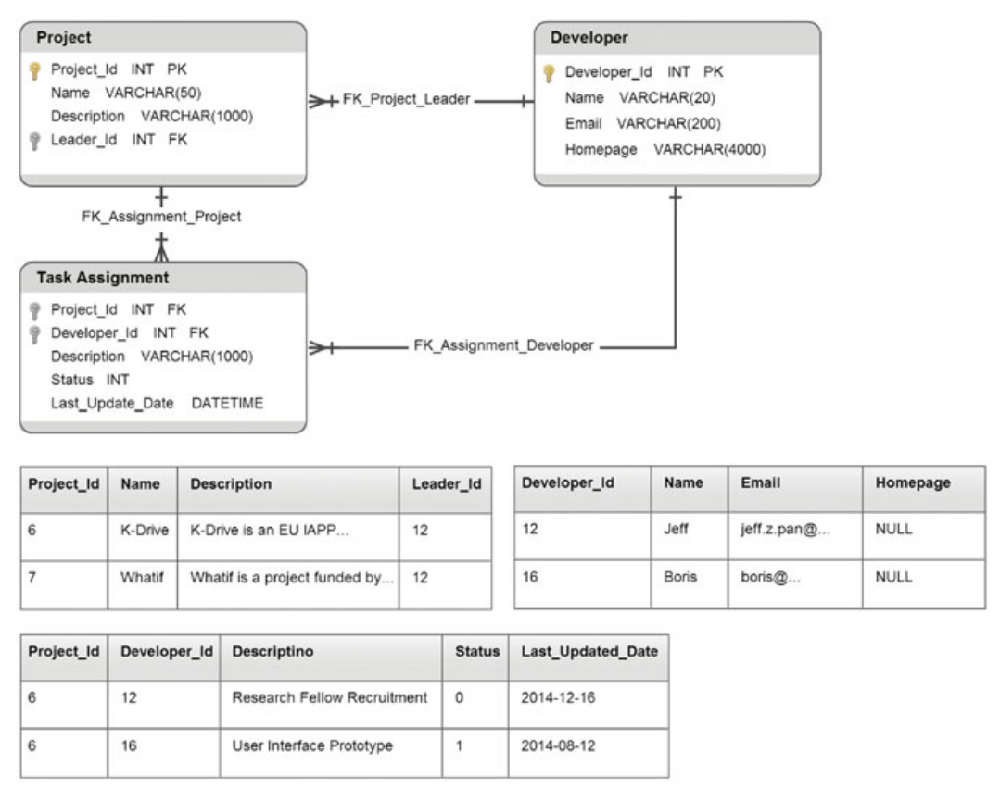
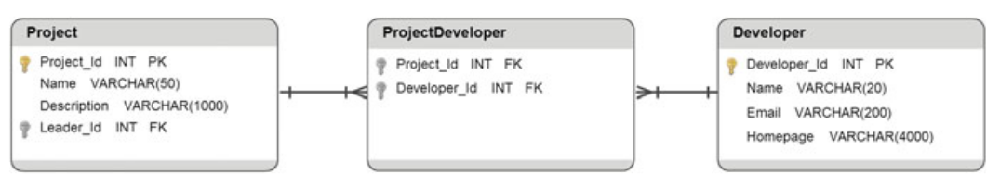
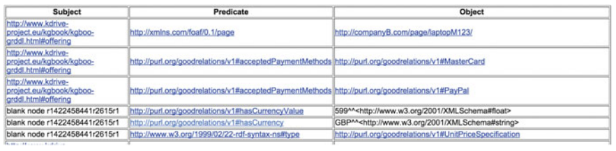

# 2.3 数据提升标准

在许多大型组织中，数据或知识可能以各种格式存在，例如关系数据库，网页，文档，事务日志等。如果要在组织的知识图中访问这些信息，就需要将它们从当前表示转换为知识表示的形式。在我们的场景中，即要转换成RDF数据模型。这个转换过程称为数据提升，意味着转换不仅是格式上的转换，还是从数据级别到机器可读的知识级别的信息的提升。

进行数据提升的方法有很多，例如使用命名实体识别、信息抽取、概念挖掘、文本挖掘等方法从自然语言文本或者网页中提取知识，也有很多开源的或商用的工具或者库，例如[GATE](https://gate.ac.uk/)，[OpenNLP](http://opennlp.apache.org/index.html)，以及[RapidMine](https://rapidminer.com/)等.

在本节中，我们将着重关注两个关于数据提升的W3C标准，即RDB2RDF和GRDDL。这两个标准涵盖了从结构化或半结构化遗留数据的数据提升，可能是大型组织中最重要的数据格式。其中，RDB2RDF定义了如何将关系数据转换为RDF格式（在第2.3.1节中介绍），而GRDDL则定义了将XML数据转换为RDF的标准方法（在第2.3.2节中简要介绍）。

## 2.3.1 RDB2RDF

如果您正在为大型组织构建知识图谱，或者你只想享受开源链接数据的好处（例如成熟的推理或者数据集成等系统），那么您很可能需要将您的数据从关系型数据库转换成一个链接数据格式，即RDF或OWL。那么，您将不必从头开始转换，因为有一种标准来帮您实现这一点，不仅如此，您还可以找到一些工具来有效提高您的工作效率。在本小节中，我们将介绍W3C推荐标准中关于将关系型数据转换成RDF格式的推荐以及与此任务相关的工具列表。

在2012年，W3C的RDB2RDF工作组发布了两份推荐标准，这两份标准是用于标准化将关系数据和关系数据库模式层映射到RDF和OWL的语言的，针对将关系数据转换成RDF的两种典型方案设计的。其中，第一份推荐为[将关系数据直接映射到RDF（Direct Mapping of Relation Data to RDF）](http://www.w3.org/TR/rdb-direct-mapping/)。如果您偏爱快速转换，而且您的数据库架构设计的足够好（定义了不错的主键和外间，表和列名都有意义等），那么直接映射将是一个不错的选择。在这种情况下，数据库（数据和模式）作为唯一的输入，输出的则是数据对应的RDF版本。这份标准使用简单，但没办法进行转换设置。第二份推荐标准则是[R2RML：RDB到RDF的映射语言](http://www.w3.org/TR/r2rml/)。您可以通过使用R2RML来自定义映射，最后根据您的设计来生成RDF数据。例如，如果您想重用一些流行词或者预定义的域本体来生成RDF，那么您应该使用R2RML。表2.2给出了在两个标准之间做出选择的一些潜在考虑因素。

|考虑因素|直接映射|R2RML|
|-------|-------|-------|
|自动映射|Y|N|
|自定义词汇|N|Y|
|自定义URI|N|Y|
|提取-转换-加载|N|Y|
|场景举例|LOD Piblish<br>例如，SPARQL的端点，发送实体数据（HTTP303）|数据集成<br>例如，重用流行词汇/本体<br>推理服务<br>例如，一致性检查，新知识的派生|

### 直接映射

如果您想试用RDF格式的数据，而又不想学习R2RML语言，那么您可以使用直接映射来进行数据的RDF化。相比于介绍这个规范的细节，我们更偏向于使用一个简单的例子来说明主要的转换细节。假设你的数据是关于项目开发的，其中包含有关项目，开发人员和任务分配的信息。直接映射的输入仅有数据库（包括数据和模式），而输出则是通过转换得到的RDF数据。示例的数据库可能想图2.11所示：上半部是模式，即三个表的定义和主/外键的定义；下半部分则是数据，即三个表中的数据。直接映射的规范从本质上来看是进行自动转换的算法，接下来将介绍这个过程的主要步骤。



在直接映射的过程中，采用了以实体为中心的方式进行转换。值得注意的是，数据库中的每一行数据都会被视为描述实体的一个三元组。因此，转换的第一步是从每行数据中识别实体（RDF资源）。在生成RDF资源时根据主键要考虑两种情况。

当数据表存在主键时，为表中的每一行生成URI资源。以图2.11中的Project表为例，在这个表中，*Project_Id*为主键。预定义基URI（*URI_BASE*）为http://abc.org/DB/，则我们将为Project表的第一行数据（*Project_Id* = 6）生成URI资源http://abc.org/DB/Project/Project_Id=6 。生成URI资源时要遵循语法'URI_BASE'+'COLUMN1_NAME = COLUMN1_VALUE; COLUMN2_NAME = COLUMN2_VALUE ...'，其中URI_ BASE是基URI，{COLUMN1，COLUMN2，...}是数据表所定义的主键集。

第二种情况则是数据表不存在主键。在这种情况下，需要为每一行数据定义一个空节点。例如，*Task_Assignment*数据表没有定义主键，在表格的第一行，为其生成一个空白节点_:b5作为中心实体的内部ID。生成空白节点没有特定的语法，只要节点是唯一的，节点就是有效的。

为每一行数据生成RDF资源之后，下一步就是将每一行数据转换成描述新生成的资源的RDF三元组。要生成的第一个三元组是类型断言，仅指定该行数据是其表类（为表生成的类）的实例。例如，我们可以将*Project*表的第一行的类型断言设为<DB:Project/Project_Id = 6,rdf:type,DB:Project>，其中DB表示之前提到的基URI。

除了类型断言之外，，每一行数据中的所有列值都需要转换成三元组。根据表模式定义的不同，可以生成两种类型的三元组。第一种是数据值三元组，其具有字面量作为对象，从不涉及任何外键定义的列中生成。

而对于那些外键列，生成的三元组将会互相关联，这意味着他们的对象是URI资源或者空节点。以*Project*表的模式为例，name列上没有定义外键。因此，其name值为K-Drive的数据行将转换成三元组<DB:Project/Project_Id = 6,DB:Project＃Name,"K-Drive">.

而另一种类型的列是外键列，例如列Leader_Id被定义为与Developer表中的Developer_Id列的外键。该列的值将转换成K-Drive项目与其领导开发人员（即Jeff）之间的关系。在这个转换过程中主要关注如何获取三元组中对象的RDF资源。考虑到外键会引用另外一个数据行（通常在另外一个表中），我们应该从引用的数据行开始，相应的生成由外键列表示的实体。找到引用的数据行之后，我们可以通过GETRowRES函数的相同逻辑来生成RDF资源。在我们的示例中，需要从*Developer*表的第一行生成*Leader_Id*值为12的实体*DB:Developer/Developer_Id = 12*。最终，将Leader_Id列转换成三元组*<DB:Project/Project_Id = 6,DB:Project#ref-Leader_Id,DB:Developer/Developer_Id = 12>*。
另一种类型的列是外键列。例如，Leader_Id

通过在所有数据表上应用上述逻辑，我们最终得到的示例数据库的RDF转换结果类似于清单2.1中所示。

    @base <http://abc.org/DB/>
    @prefix xsd: <http://www.w3.org/2001/XMLSchema#> .
    <Project/Project_Id=6> ref:type <Project> .
    <Project/Project_Id=6> <Project#Project_Id> 6 .
    <Project/Project_Id=6> <Project#Name> "K-Drive" .
    <Project/Project_Id=6> <Project#Description> "K-Drive is an EU IAPP ..." .
    <Project/Project_Id=6> <Project#ref-Leader_Id> <Developer/Developer_Id=12> .
    <Project/Project_Id=7> ref:type <Project> .
    <Project/Project_Id=7> <Project#Project_Id> 7 .
    <Project/Project_Id=7> <Project#Name> "Whatif" .
    <Project/Project_Id=7> <Project#Description> "Whatif is a project funded by ..." .
    <Project/Project_Id=7> <Project#ref-Leader_Id> <Developer/Developer_Id=16> .

    <Develop/Developer_Id=12> ref:type <Developer> .
    <Developer/Developer_Id=12> <Project#Developer_Id> 12 .
    <Developer/Developer_Id=12> <Project#Name> "Jeff" . <Developer/Developer_Id=12> <Project#Email> "jeff.z.pan@..." .
    <Developer/Developer_Id=16> rdf:type <Developer> .
    <Developer/Developer_Id=16> <Project#Developer_Id> 16 .
    <Developer/Developer_Id=16> <Project#Name> "Boris" .
    <Developer/Developer_Id=16> <Project#Email> "boris@..." .

    _:b5 rdf:type <Task_Assignment> .
    _:b5 <Task_Assignment#ref-Project_Id> <Project/Project_Id=6> .
    _:b5 <Task_Assignment#ref-Developer_Id> <Developer/Developer_Id=12> .
    _:b5 <Task_Assignment#Status> 0 .
    _:b5 <Task_Assignment#Last_Updated_Date> "2014-12-16" .
    _:b6 rdf:type <Task_Assignment> .
    _:b6 <Task_Assignment#ref-Project_Id> <Project/Project_Id=7> .
    _:b6 <Task_Assignment#ref-Developer_Id> <Developer/Developer_Id=16> .
    _:b6 <Task_Assignment#Status> 1 .
    _:b6 <Task_Assignment#Last_Updated_Date> "2014-08-12" .

### RDB2RDF映射语言

正如前面所述，直接映射是一种有效地实现将RDB数据快速转换成RDF的方法。然而，在许多实际场景中，直接映射可能并不能满足所有需求，例如，将项目相关的数据库转换成RDF时，您可能想要试用流行的领域本体，如DAOP（[Description of a Project Vocabulary](http://usefulinc.com/ns/doap)），因为使用流行的领域本体可以提高了知识图谱的可视化，并使其更容易与其他知识图谱集成或者建立链接。不仅如此，直接映射在某些情况下可能会产生不必要的转换。例如，如图2.12所示，假设还有一个表对那些开发人员参与了哪些项目进行了简单的描述，直接映射将创建空白节点来表示这种关系，而这明显不是最有效的方法。更有效以及更简单的映射可能是使用类似于*involvedIn*的属性来直接说明开发者和项目之间的关系。在某些情况下，您会考虑到机密或信息安全而不想共享某部分数据，例如，您可能希望再知识图谱的RDF版本中不发布开发人员的电子邮件信息。



以上所述的三个示例都需要使用自定义转换，而这恰恰是直接映射无法提供的。第一个示例需要自定义RDF资源的生成，第二个示例需要需要自定义转换，而第三个示例则需要能够提取部分数据进行转换。这些要求跟RDB2RDF映射语言的主要结构相对应：

- **术语映射**： 在RB2RDF规范中，RDF术语用于表示IRI的所有类型的RDF资源，空白节点和字面量。术语映射本质上是一种能够从数据行中生成自定义术语的函数，而这也使领域本体的重用成为可能。
- **逻辑表**：如名称所示，逻辑表是一个从真实存在的表格中构造出的虚拟表，该表在进行三元组转换之前可以进行自定义数据提取，满足第三个示例的要求。
- **三元组映射**：此映射机制只在指定如何从数据行中生成三元组，它支持自定义映射，满足第二个示例中的问题。

在本小节的剩下的部分，我们将对这三个结构进行介绍。

#### 术语映射

术语映射是从数据行（来自数据库定义，如表或视图，以及我们即将介绍的逻辑行）生成RDF资源的函数。对于示例数据库中的*Project*表，假设我们想为每行数据生成一个类型断言，那我们可能更偏向于使用DOAP词汇表，例如使用*doap:Project*（ xmlns:doap=“http://usefulinc.com/ns/doap#” ）来作为类名，而不是使用由直接映射生成的“直接”的词汇URI。为了在R2RML中实现这一个功能，我们可以试用以下映射定义。

    [] rr:predicatempa [rr:constant rdf:type];
       rr:objectMap [rr:constant doap:Project] .

值得注意的是，无论数据行的内容如何，这个映射都会为断言中的谓词和客体组件生成相同的RDF资源对：*rdf:type* 和 *doap:Project*。这被成为恒定值术语映射（constant-valued term map）。

除了常量资源以外，数据转换中最常见的任务是将表中的数据值转换成RDF资源。如果您只是想简单的将数据列中的值转换成字面量资源，那么在R2RML中，最简单的方法则是使用列值术语映射（column-valued term map）。对于我们示例中的*Project*表，以下映射将会把*name*列的值转换成作为三元组的客体组件的字面量。请注意，*rr:column*后面的值应该为有效的列名。

    [] rr:objectMap [ rr:column "Nmae" ] .

术语映射中可自定义程度最高的是最后一种模版值术语映射（template-valued term map）。这是一种可以使用字符串模板来自定义URI模式的方法。其语法非常简单：使用常量字符串，其中，用大括号括起来的为列名称，意味着您希望将该列值作为其中一部分。以下示例使用了*Project_Id*列作为变量部分来对URI进行自定义

    [] rr:subjectMap [ rr:template "http://abc.org/DB/Project/ID/{Project_Id}" ] .

#### 逻辑表

在R2RML中，逻辑表是一种能够使用SQL查询从原始数据库中进行自定义数据抽取和转换的方法。例如，在*Developer*表中，如果想要在生成的RDF中省去电子邮件信息，则可以使用简单的SQL查询来定义逻辑表，从而只选择必须的列

    [] rr:sqlQuery """
        Select Developer_Id,
        Name,
        Homepage
            from Developer
    """.

使用SQL查询不仅可以给数据提取提供支持，还可以使用数据库的内置函数进行数据转换，例如，MD5是MySQL 5.5.3版本之后的内置函数。例如，如果有人想要使用开发者的电子邮箱来作为他们的唯一的ID，因为*Developer_Id*不是全局唯一的，则在开放的数据环境中以下逻辑表定义可能更有价值：

    [] rr:sqlQuery """
        Select MD5(Email) as Developer_Id,
        Name,
        Homepage
            from Developer
    """.

当然，最简单的逻辑表形式是直接重用数据库中定义的表或视图。例如，简单的饮用*Developer*表：````[] rr:tableName "Developer" .````

#### 三元组映射

术语映射和逻辑表都是映射定义的组成部分。为了将它们结合起来一起进行转换过程的定义，我们需要使用三元组映射。三元组映射定义了一行数据转换成一些列RDF三元组的过程。以下三元组映射定义了将*Name*和*Description*列转换成两个RDF三元组的规则。

    []
        rr:logicalTable [rr:tableName "Project"];
        rr:subjectMap [rr:template "http://abc.org/DB/Project/ID/{Project_Id}"];
        rr:predicateObjectMap [
            rr:predicateMap [rr:constant DB:name];
            rr:objectMap [ rr:column "Name" ];
        ];
        rr:predicateObjectMap [
            rr:predicate DB:decription;
            rr:objectMap [ rr:column "Description" ];
        ].

每一个三元组映射都有一个logicalTable和一个subjectMap。基于术语映射，subjectMap定义每一行数据将要生成的三元组中的主体。predicateObjectMap定义了三元组中的谓词-客体对，可以有一个或者多个。在我们的示例中，有两个predicateObjectMap，其中每一个都定义了要在列值术语映射上生成的三元组。请注意，在第二种predicateObjectMap中，我们使用了predictMap的更简单的语法，这个被称为常量缩写属性，可以直接使用rr:predicate后面跟常量资源来对rr:constant进行省略。根据示例中的映射，生成的三元组如下:

    @base <http://abc.org/DB/>
    @prefix DB: <http://abc.org/DB/>.
    <Project/ID/6> DB:name "K-Drive".
    <Project/ID/6> DB:desription "K-Drive is an EU IAPP...".
    <Project/ID/7> DB:name "Whatif".
    <Project/ID/7> DB:description "Whatif is a project funded by...".

回到图2.12的示例，我们的其中一个动机是可以使用以下三元组映射生成项目和开发人员之间关系的三元组。

    []
        rr:logicalTable [rr:tableName "ProjectDeveloper"] ;
        rr: subjectMap [rr:template "http://abc.org/DB/Project/ID/{Project_Id}"];
        rr:predicateObjectMap [
            rr:predicate DB:hasDeveloper;
            rr:objectMap [rr:template "http://abc.org/DB/project/ID/{Developer_Id}"];
        ];

### RDB2RDF工具

RDB2RDF规范还有各种实现。W3C在2012年发布了一份关于这些实现产品的报告。虽然它略显过时，但仍值得参考：[http：//www.w3.org/TR/rdb2rdf-implementations/](http：//www.w3.org/TR/rdb2rdf-implementations/)。作为W3C列表的扩展补充，我们简要介绍一些最出著名的工具：

- Morph-RDB（以前成为ODEMapster），是由本体工程小组开发的RDB2RDF引擎。它支持两种操作模式：数据升级（从关系数据库中生成RDF实例）和查询转换（SPARQL转换成SQL），可在以下网址中查看：[https：//github.com/oeg-upm/morph-rdb](https：//github.com/oeg-upm/morph-rdb)
- D2RQ平台，是一个将关系数据库作为一个虚拟只读的RDF图来进行访问。它提供对关系数据库内容的基于RDF的访问，而无需将其复制到RDF存储中，可在以下网址查看：[http：//d2rq.org/](http：//d2rq.org/)
- 一些三元组存储或者RDF数据库系统也拥有自身对RDB2RDF的实现功能。例如[Virtuoso](http://virtuoso.openlinksw.com/) 有自己以前开发的与R2RML等价的语言，称为链接数据视图（Linked Data Views），现在Virtuoso通过潜入一个简单的翻译器来支持R2RML，该翻译器将R2RML语法转换成Virtuoso自己的链接数据视图语法。可在以下网页中查看：[http://virtuoso.openlinksw.com/dataspace/doc/dav/wiki/Main/VirtR2RML](http://virtuoso.openlinksw.com/dataspace/doc/dav/wiki/Main/VirtR2RML)

## 2.3.2 GRDDL

除了存储在关系型数据库中，需要提升的数据也可能以其他形式被存储，其中常见的就是XML格式。例如，零售商部分的采购清单以XML格式编码，使用XML语法的数据或者问题的信息都可以简单的在Web上作为网页（XHTML）发布。虽然这些数据都存储在XML中，但各自的语法和语义可能完全不同，而这给组织的知识图谱的集成造成了阻碍。

为了在组织的知识图谱中使用所有这些不同的XML数据源，您可能想要将他们转换成RDF表示。这个过程本质上是将数据从一种XML格式转换到另一种格式。虽然这样一个转换过程不是一项复杂的任务，但在过程中还有许多因素需要考虑，例如，如何识别这个XML数据源是否提供转换，如果是，那么转换算法是什么以及如何确定算法的使用。每一个问题都有相应的方法，如果没有统一的过程，解决方案的异质性可能是知识融合的另一个障碍。值得庆幸的是，W3C的推荐标准[GRDDL](http://www.w3.org/TR/grddl/)致力于提供从XML特有的语法中导出RDF中的资源描述的标准方法。

GRDDL从本质上制定了一种标准化方式，用于声明一个XML文档是否包含与RDF兼容的信息，以及如果包含，那么其转换算法在哪里。尽管有许多方法可以实现这种转换算法，但非常常见的方法是W3C的标准XSLT——XML的转换语言。GRDDL针对通用XML文档和XHTML Web页面对上述规范进行了标准化，此外，它还允许在XML命名空间文档和XHTML配置文件的元文档（meta-documents）中指定可收集的数据，这使那些与元文档相关联的文档都可以应用这些规范。

在本小节中，我们将通过一个XHTML网页的示例来讨论使用GoodRelations词汇表的产品。

### 产品网页示例

假设A公司已从竞争对手B公司抓取了大量与产品相关的网页。为了将产品信息整合到A公司的知识图谱中以供进一步调查，A公司希望将此信息转换为RDF。B公司使用GoodRelations词汇表来描述他们的产品，产品页面的一小部分如下所示：

    <div xmlns:rdf="http://www.w3.org/1999/02/22-rdf-syntax-ns #"
    xmlns="http://www.w3.org/1999/xhtml"
    xmlns:foaf="http://xmlns.com/foaf/0.1/"
    xmlns:gr="http://purl.org/goodrelations/v1#"
    xmlns:xsd="http://www.w3.org/2001/XMLSchema#">
        <div about="#offering" typeof="gr:Offering">
            <div property="gr:name" content="CompanyB Laptop Model123" xml:lang="en"></div>
            <div property="gr:description" content="A classic, timeless design Providing a smooth computing experience Precise, crystal clear audio to complete the cinematic experience Access your data and files anytime, anywhere" xml:lang="en"></div>
            <div rel="foaf:depiction" resource="http://companyB.com/previews/LaptopM123/ images/intro.jpg">
            </div>
            <div rel="gr:hasBusinessFunction"resource="http://purl.org/goodrelations/v1#Sell"> </div>
            <div rel="gr:hasPriceSpecification">
                <div typeof="gr:UnitPriceSpecification">
                    <div property="gr:hasCurrency"content="GBP" datatype="xsd:string"></div>
                    <div property="gr:hasCurrencyValue"content="599" datatype="xsd:float"></div>
                </div>
            </div>
            <div rel="gr:acceptedPaymentMethods" resource="http://purl.org/goodrelations/v1#PayPal"></div>
            <div rel="gr:acceptedPaymentMethods" resource="http://purl.org/goodrelations/v1# MasterCard"></div>
            <div rel="foaf:page"resource="http://companyB.com/page /laptopM123/"></div>
        </div>
    </div>

产品元数据采用了GoodRelations词汇，使用了[RDFa](http://www.w3.org/TR/xhtml-rdfa-primer/)语法来进行说明的。为了使用GRDDL标准来抽取笔记本电脑的信息，A公司需要在爬取到的网页中注入两条信息。其中，第一条信息是声明这个网页包含GRDDL元数据。对于一个XHTML文档，GRDDL重用其HTML页面的构造的profile。如以下HTML代码的第二行所示，将head标签的profile属性设为 “http://www.w3.org/2003/g/data-view”，从而此页面可以使用GRDDL将其元数据提取到RDF中。

    <!DOCTYPE html PUBLIC "-//W3C//DTD XHTML 1.1//EN""http:// www.w3.org/TR/xhtml11/DTD/xhtml11.dtd"><html xmlns=" http://www.w3.org/1999/xhtml" xml:lang="en"lang="en">
        <head profile="http://www.w3.org/2003/g/data-view"> <title>Company B’s Laptop Model 123 Product</title>
        </head>
        <body>
        ...

当确定页面与GRDDL兼容之后，下以后需要确认转换算法是什么。在我们的示例中，我们使用XML转换语言[XSLT](http://www.w3.org/TR/xslt)，这是将XML文档转换成另外一种格式的最常用的方法。以下HTML代码中的第三行说明了如何在GRDDL中指定转换元数据的XSLT模板。由于在我们的示例中，产品的元数据使用了RDFa的格式，因此在这个例子中，我们使用一般的XSLT模板来将RDFa格式的数据转换成RDF格式： http://www.w3.org/2008/07/rdfa-xslt。在实际情况中，用户应该根据需要转换的元数据的语法选择合适的转换算法或者定义新的转换。

    <!DOCTYPE html PUBLIC "-//W3C//DTD XHTML 1.1//EN""http:// www.w3.org/TR/xhtml11/DTD/xhtml11.dtd"><html xmlns=" http://www.w3.org/1999/xhtml" xml:lang="en" lang="en">
        <head profile="http://www.w3.org/2003/g/data-view"> <title>Company B’s Laptop Model 123 Product</title> <link rel="transformation" href="http://www.w3.org/2008/07/rdfa-xslt"/> </head>
        <body>
        ...

在明确转换算法之后，我们已成功更新了GRDDL的设置以适用于我们的产品示例，最终的HTML也页面在[http://www.kdrive-project.eu/kgbook/kgboo-grddl.html](http://www.kdrive-project.eu/kgbook/kgboo-grddl.html)上可见。

执行这个转换的最后一步就是要找到支持GRDDL抽取的软件或者服务网站[http://www.w3.org/wiki/GrddlImple-mentations](http://www.w3.org/wiki/GrddlImple-mentations)列出了GRDDL标准的一些常用的实现。为了测试运行我们的示例，我们可以使用在线的GRDDL服务librdf.org，向这个服务提供我们[最终的HTML页面](http://www.kdrive-project.eu/kgbook/kgboo-grddl.html)。你可以直接在浏览器打开这个快捷方式来查看我们示例的输出：[http://librdf.org/parse?language=grddl&uri=http%3A%2F%2Fwww.kdrive-project.eu%2Fkgbook%2Fkgboo-grddl.html&content=&Run+Parser=Run+Parser&.cgifields=language](http://librdf.org/parse?language=grddl&uri=http%3A%2F%2Fwww.kdrive-project.eu%2Fkgbook%2Fkgboo-grddl.html&content=&Run+Parser=Run+Parser&.cgifields=language)。如果一切顺利，您将看到最终的结果页面，页面上有一个包含所有转换后得到的三元组的表格，表格前几行看起来和图2.13完全相同。

